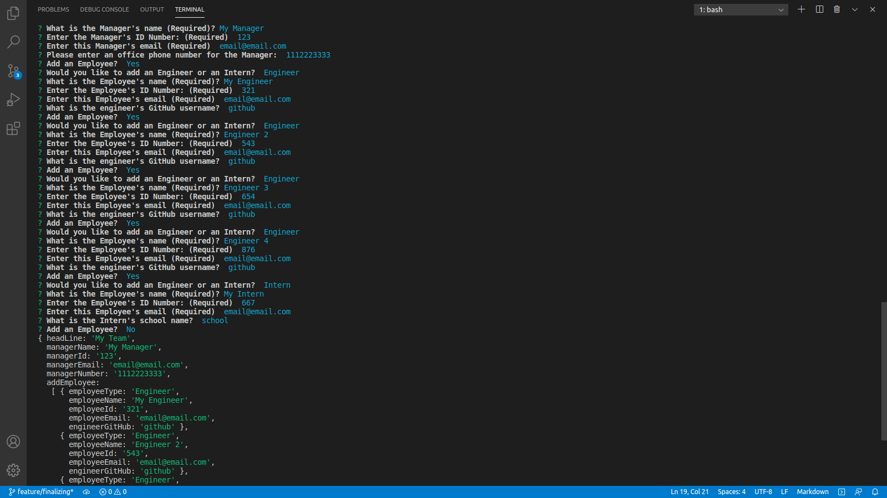
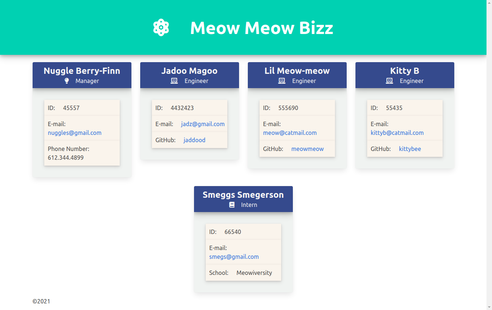

# liaison

---------------------------------------

## Description
This app generates a Team Dashboard using the command line for easy access to team information

---------------------------------------

Project Link: 
[Liaison](https://github.com/jaderiver62/liaison)

---------------------------------------

## Table of Contents
* [Installation](#installation)
* [Usage](#usage)
* [License](#license)
* [Testing](#testing)
* [Questions](#questions)

---------------------------------------

---------------------------------------

## Installation
Installation dependencies:
* [node.js](https://nodejs.org/en/)
* [npm](https://www.npmjs.com/)

Clone the code in our repo and install npm.  From the command line run the following code:

>
>$ node index
>

Answer the prompts and new [index.html](src/dist/index.html) and [style.css](src/dist/style.css) files will be generated in the [src/dist/](src/dist/) folder.

---------------------------------------

## Usage

To generate the liaison dashboard simply follow the prompts in the command line to input your teams' data!

The following image shows an example of the results after running liaison:

Please see this video to watch liaison as it's supposed to run: [liaison](https://drive.google.com/file/d/1AzHx7LJeq1fQy4OE3BdHj4xiKCVcP3e0/view)

---------------------------------------

## Testing
Testing liaison is simple, but it does require [Jest](https://jestjs.io/).  Once Jest is installed simply run the following command lines:

>
>$ npm run test
>

This code will test all of the object classes in liaison to ensure that it is working correctly.

All tests should pass, if they don't pass your testing please [contact](#questions) the creater!

## Languages

Written using:

                    
* JavaScript
   
* HTML
   
* CSS
   
* ES6

* Node
   

---------------------------------------

## Questions

For any input, concerns, bugs or questions please get in touch!  Simply reach out to [Nina Cummings](https://github.com/jaderiver62/liaison) via GitHub or via e-mail: jaderiver64@gmail.com.

---------------------------------------

## Licence

#### This project is licensed under the [MIT License](https://opensource.org/licenses/MIT).
#### &copy; 2021 Nina Cummings

---------------------------------------
    